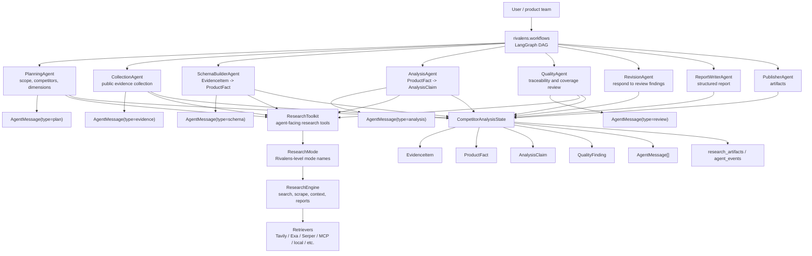
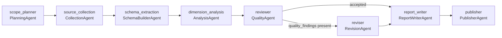

# Rivalens

Rivalens is an AI-driven competitor analysis agent system.

The project is being shaped into a traceable multi-agent workflow for market
intelligence. The main package is `rivalens`, with these primary domains:

- `rivalens/workflows`: DAG task orchestration for competitor analysis.
- `rivalens/agents`: specialist agents for collection, analysis, writing, and quality review.
- `rivalens/schema`: structured competitor knowledge and evidence schema.
- `rivalens/research`: research modes, tools, retrievers, and the underlying research engine.

The generic research implementation lives inside `rivalens/research` as the web
research engine beneath Rivalens agents.

## Architecture



## Active Workflow

The active LangGraph entry point is `rivalens/workflows/agent.py`. Its current
multi-agent DAG is:



`source_collection` uses `ResearchToolkit.collect_evidence()`, which wraps
`rivalens.research.ResearchEngine` search and deep-research capability as an
evidence collection tool. The final report is produced only after schema
extraction, analysis, and review have run over traceable evidence.

Agents also exchange structured messages through `CompetitorAnalysisState.messages`.
Each `AgentMessage` contains `sender`, `receiver`, `type`, `payload`,
`artifact_ids`, `evidence_ids`, and `created_at`, giving the workflow a
function-calling-like collaboration surface instead of relying only on free-form
text.

## Research Modes

Agents call `ResearchToolkit` methods instead of low-level report types:

```text
standard_evidence  -> research_report
deep_evidence      -> deep
source_discovery   -> resource_report
outline_assisted   -> outline_report
schema_extraction  -> custom_report
focused_analysis   -> detailed_report
subtopic_evidence  -> subtopic_report
```

This keeps agent responsibilities separate from the underlying research engine
while still giving every agent a channel to use the right research capability.

## Current Caveat

The current `ResearchToolkit` wiring is intentionally provisional. Some mappings
are useful as capability channels, but they are still too mechanical:

- `PlanningAgent -> generate_outline() -> outline_report` can help when the user
  has not provided analysis dimensions, but it should not always run.
- `CollectionAgent -> collect_evidence() -> research_report/deep` is the most
  natural mapping and should remain the primary evidence-gathering path.
- `SchemaBuilderAgent -> extract_schema() -> custom_report` is plausible for
  structured extraction, but its output is not yet parsed as the source of truth.
  The current source of truth remains `EvidenceItem -> ProductFact`.
- `AnalysisAgent -> focused_analysis() -> detailed_report` can support complex
  analysis, but running it by default risks recreating a long-form report path
  instead of reasoning from normalized facts.
- `QualityAgent -> discover_sources() -> resource_report` is the weakest current
  mapping. Quality review should first audit existing claims and evidence; it
  should only request more source discovery when it finds a coverage or citation
  gap.

The intended next step is to make research-tool calls conditional. Agents should
first execute their core responsibilities against `CompetitorAnalysisState`, then
call `ResearchToolkit` only when the state shows a genuine need: missing scope,
insufficient evidence, ambiguous schema extraction, weak analysis confidence, or
failed quality review.
