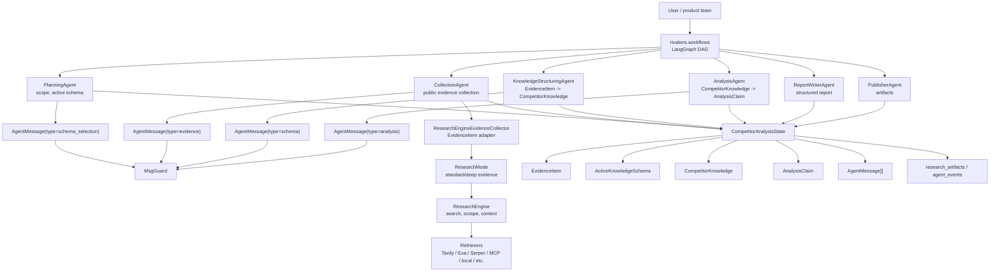
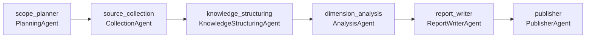

# Rivalens

Rivalens is an AI-driven competitor analysis agent system.

The project is being shaped into a traceable multi-agent workflow for market
intelligence. The main package is `rivalens`, with these primary domains:

- `rivalens/workflows`: DAG task orchestration for competitor analysis.
- `rivalens/agents`: specialist agents for planning, collection, knowledge structuring, analysis, writing, and publishing.
- `rivalens/schema`: structured competitor knowledge and evidence schema.
- `rivalens/research`: evidence collection adapters, retrievers, and the underlying research engine.

The generic research implementation lives inside `rivalens/research` as the web
research engine beneath Rivalens agents.

## Architecture



## Active Workflow

The active LangGraph entry point is `rivalens/workflows/agent.py`. Its current
multi-agent DAG is:



`scope_planner` owns the planning phase end to end: it normalizes competitor
inputs, selects and freezes an `ActiveKnowledgeSchema` from the schema registry,
then emits one `schema_selection` handoff to
`source_collection`. `source_collection` expands that schema into competitor-by-
dimension collection tasks and runs them concurrently through
`ResearchEngineEvidenceCollector`, which wraps
`rivalens.research.ResearchEngine` as a narrow evidence adapter. It normalizes
research sources into `EvidenceItem` records with collection task and schema
dimension metadata. The final report is produced only after evidence has been
structured into `CompetitorKnowledge` and analyzed into traceable claims.

## Structured Agent Messages

Agents exchange validated JSON messages through
`CompetitorAnalysisState.messages`. Each `AgentMessage` contains `sender`,
`receiver`, `type`, `payload`, `artifact_ids`, `evidence_ids`, and `created_at`.
The payload is validated before it is appended to state. Active handoffs
currently use these Pydantic payloads:

```text
schema_selection -> SchemaSelectionMessagePayload
evidence -> EvidenceMessagePayload
schema   -> SchemaMessagePayload
analysis -> AnalysisMessagePayload
report   -> ReportMessagePayload
publish  -> PublishMessagePayload
```

Downstream agents consume the latest validated message addressed to them with
`latest_message_for(...)`. This makes each DAG edge behave more like a
function-calling contract: the shared state remains observable, but the handoff
between agents has explicit typed inputs instead of arbitrary free-form text.

## Evidence Collection Boundary

Search is intentionally owned by `CollectionAgent`. Other agents consume
structured state and messages; they do not call the research engine directly.

`CollectionAgent` calls `ResearchEngineEvidenceCollector`, which keeps the
ResearchEngine wiring out of agent business logic:

```text
CollectionAgent
  -> ResearchBranch frontier
  -> BranchReviewAgent expand/stop decisions
  -> EvidenceCollectionTask
  -> ResearchEngineEvidenceCollector (standard evidence)
  -> ResearchEngine
  -> EvidenceItem[]
```

The collection path uses standard evidence collection for each branch. Deep
research recursion is not used as a black box inside `ResearchEngine`; instead,
Rivalens keeps branch lineage, review decisions, depth, and budget in
`CompetitorAnalysisState.research_branches` and
`CompetitorAnalysisState.branch_review_decisions`.

Root branches are required schema coverage: every competitor x active schema
dimension is collected before any depth expansion is considered. The expansion
budget applies only to child branches created by `BranchReviewAgent`, with
`max_root_branch_hard_limit` acting as a defensive cap for unusually large
schemas and `max_expansion_branches` controlling follow-up breadth.

This keeps provider calls, source normalization, costs, and evidence metadata in
one place while preserving the main Rivalens chain:

```text
EvidenceItem -> CompetitorKnowledge -> AnalysisClaim -> Report
```

`PlanningAgent`, `KnowledgeStructuringAgent`, `AnalysisAgent`, and
`ReportWriterAgent` do not run their own research/report modes by default.
The previous end-of-pipeline `QualityAgent` and `RevisionAgent` have been
removed because they created a late, claim-deletion-oriented pseudo loop.
`BranchReviewAgent` remains collection-time branch expansion logic: it reviews
the current branch evidence only to decide whether to expand or stop child
queries against the current competitor, schema dimension, evidence gaps, drift
risk, and expansion budget. A separate collection-time evidence review gate is
the next design discussion before adding new review behavior.
