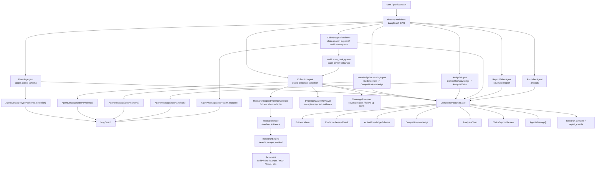
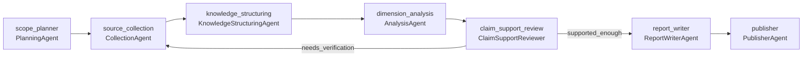

# Rivalens

Rivalens is an AI-driven competitor analysis agent system.

The project is being shaped into a traceable multi-agent workflow for market
intelligence. The main package is `rivalens`, with these primary domains:

- `rivalens/workflows`: DAG task orchestration for competitor analysis.
- `rivalens/agents`: specialist agents for planning, collection, collection-time evidence review, branch control, knowledge structuring, analysis, writing, and publishing.
- `rivalens/file_context`: reusable CSV, Excel, JSON, and screenshot context helpers.
- `rivalens/schema`: structured competitor knowledge and evidence schema.
- `rivalens/research`: evidence collection adapters, retrievers, and the underlying research engine.

The generic research implementation lives inside `rivalens/research` as the web
research engine beneath Rivalens agents.

## Persistence

Docker Compose provisions two persistence services:

- `postgres`: PostgreSQL 16, default database `rivalens`.
- `redis`: Redis 7 with append-only persistence enabled.

The application receives these endpoints through `DATABASE_URL` and `REDIS_URL`.
PostgreSQL data is stored in the `rivalens-postgres-data` Docker volume, and
Redis data is stored in `rivalens-redis-data`. `backend/server/persistence.py`
defines the traceability tables for run scope, confirmed directions, collection
DAG nodes, evidence, coverage and evidence review gates, structured knowledge,
analysis claims, claim-support reviews, and compact Agent events. Automatic
table creation is disabled by default; set `RIVALENS_AUTO_CREATE_TABLES=true`
to enable SQLAlchemy `create_all()` on backend startup, or run the SQL scripts
under `backend/server/sql_table_create` manually.

## Architecture



## Active Workflow

The active LangGraph entry point is `rivalens/workflows/agent.py`. Its current
multi-agent DAG is:



`scope_planner` owns the planning phase end to end: it normalizes competitor
inputs, selects and freezes an `ActiveKnowledgeSchema` from the schema registry,
keeps the industry template directions separate from PlanningAgent supplement
directions, then emits one `schema_selection` handoff to `source_collection`.
The planner uses the ten general product-analysis directions only as a coverage
check for missing task-level `planner_added_directions`; they are not written
back as original industry defaults. The confirmed direction plan is stored in
`CompetitorAnalysisState.industry_direction_plan`, so the search scope can be
reviewed before evidence collection. When the user has not specified a clear
competitor pair, the preview plan surfaces industry-template example
competitors as `suggested_competitors` without automatically treating them as
selected analysis targets. When known competitors are detected in the user query
and no explicit competitor list was provided, `PlanningAgent` promotes those
`detected_competitors` into the workflow competitor scope before collection.
`source_collection` also creates a `competitor_profile` task for each selected
competitor, so report information cards are backed by explicit public profile
evidence instead of writer-only inference.
`source_collection` expands the confirmed analysis dimensions into
competitor-by-dimension collection tasks and runs them concurrently through
`ResearchEngineEvidenceCollector`, which wraps
`rivalens.research.ResearchEngine` as a narrow evidence adapter. It normalizes
research sources into `EvidenceItem` records with collection task and analysis
dimension metadata, reviews each standard-search result, and stores accepted
branch evidence for structuring and analysis. `KnowledgeStructuringAgent`
structures the accepted evidence into `CompetitorKnowledge`; `AnalysisAgent`
then generates claims from structured knowledge and accepted evidence.
`ClaimSupportReviewer` checks claim-level citation support before writing and
can create one bounded `verification_task_queue` pass back through
`source_collection` for weak or unverifiable claims.

CSV, Excel, JSON, and screenshot inputs are ingested by `rivalens/file_context`
instead of being modeled as agents. `PlanningAgent` uses the resulting summaries
and search hints during outline generation and schema selection. Collection,
knowledge structuring, and analysis reuse the same file chunks as local RAG
context while preserving the external evidence pipeline.

## Structured Agent Messages

Agents exchange validated JSON messages through
`CompetitorAnalysisState.messages`. Each `AgentMessage` contains `sender`,
`receiver`, `type`, `payload`, `artifact_ids`, `evidence_ids`, and `created_at`.
The payload is validated before it is appended to state. Active handoffs
currently use these Pydantic payloads:

```text
schema_selection -> SchemaSelectionMessagePayload
evidence -> EvidenceMessagePayload
schema   -> SchemaMessagePayload
analysis -> AnalysisMessagePayload
claim_support -> ClaimSupportMessagePayload
report   -> ReportMessagePayload
publish  -> PublishMessagePayload
```

Downstream agents consume the latest validated message addressed to them with
`latest_message_for(...)`. This makes each DAG edge behave more like a
function-calling contract: the shared state remains observable, but the handoff
between agents has explicit typed inputs instead of arbitrary free-form text.

## Evidence Collection Boundary

Search is intentionally owned by `CollectionAgent`. Other agents consume
structured state and messages; they do not call the research engine directly.

`CollectionAgent` calls `ResearchEngineEvidenceCollector`, which keeps the
ResearchEngine wiring out of agent business logic:

```text
CollectionAgent
  -> ResearchBranch frontier
  -> ResearchBrief / ResearchTask queue
  -> focused / verification search_stage control
  -> ResearchEngineEvidenceCollector (explicit ResearchMode)
  -> ResearchEngine
  -> EvidenceItem[]
  -> EvidenceQualityReviewer (source-level accepted/rejected evidence)
  -> CoverageReviewer (coverage gaps and follow-up task specs)
```

The collection path starts every confirmed competitor x dimension branch as
focused evidence collection. Claim-support follow-up uses verification. Deep
research recursion is not used as a black box inside `ResearchEngine`; instead,
Rivalens keeps branch lineage, research briefs, research tasks, evidence
reviews, coverage assessments, depth, and budget in
`CompetitorAnalysisState.research_branches`,
`CompetitorAnalysisState.research_briefs`,
`CompetitorAnalysisState.research_tasks`,
`CompetitorAnalysisState.evidence_reviews`, and
`CompetitorAnalysisState.coverage_assessments`.

`ResearchRoutingAction` is intentionally a shared routing vocabulary, not the
stage boundary. Consumers should distinguish stages with `search_stage` and the
assessment `stage_contract`: focused and verification write accepted
source-backed items to `evidence_items` and coverage observations to
`coverage_assessments`. Missing source types are handled by
`CoverageReviewer` follow-up tasks instead of a separate pre-evidence
discovery stage.

Root branches are required analysis coverage: every competitor x confirmed
analysis dimension is collected before any depth expansion is considered. The expansion
budget applies only to child branches created from `CoverageReviewer`
follow-up task specs, with
`max_root_branch_hard_limit` acting as a defensive cap for unusually large
schemas and `max_expansion_branches` controlling follow-up breadth.

This keeps provider calls, source normalization, costs, and evidence metadata in
one place while preserving the main Rivalens chain:

```text
EvidenceItem -> EvidenceReviewResult -> AnalysisClaim
EvidenceItem -> CompetitorKnowledge -> Report
```

## Search Retrievers

Rivalens can run multiple search retrievers for the same collection task by
setting a comma-separated `RETRIEVER` value. For the MVP Chinese-plus-English
search setup, use UniFuncs Deep Search for Chinese ecosystem discovery and
Tavily for broader English web discovery:

```env
RETRIEVER=unifuncs_deepsearch,tavily
SCRAPER=tavily_extract

UNIFUNCS_API_KEY=sk-your-unifuncs-key
UNIFUNCS_DEEPSEARCH_BASE_URL=https://api.unifuncs.com/deepsearch/v1
UNIFUNCS_DEEPSEARCH_MODEL=s3
UNIFUNCS_DEEPSEARCH_LANGUAGE=zh
UNIFUNCS_DEEPSEARCH_REFERENCE_STYLE=link
UNIFUNCS_DEEPSEARCH_MAX_DEPTH=8

TAVILY_API_KEY=tvly-your-tavily-key
```

The UniFuncs retriever is used for source discovery, not final report writing.
It returns source URLs and short snippets, then the existing scraper fetches full
page content before evidence review and downstream analysis. When
`SCRAPER=tavily_extract` is set, URLs discovered by either UniFuncs or Tavily are
fetched through Tavily Extract.

## Rivalens Collection Limits

For `report_type=rivalens`, the competitor-analysis workflow creates collection
branches before calling the underlying search retrievers. Use these environment
variables to reduce or expand that branch budget:

```env
RIVALENS_MAX_ROOT_BRANCHES=40
RIVALENS_MAX_BRANCH_DEPTH=0
RIVALENS_MAX_EXPANSION_BRANCHES=0
```

- `RIVALENS_MAX_ROOT_BRANCHES` caps the initial competitor x analysis-dimension
  collection branches. Budget for `(competitor count) x (selected directions + 1
  competitor_profile task)`.
- `RIVALENS_MAX_BRANCH_DEPTH=0` disables follow-up collection branches.
- `RIVALENS_MAX_EXPANSION_BRANCHES` caps follow-up branches created from
  coverage gaps.

These limits are separate from `MAX_SEARCH_RESULTS_PER_QUERY` and
`MAX_ITERATIONS`, which control how many search results and sub-queries each
individual collection branch uses.

`PlanningAgent`, `KnowledgeStructuringAgent`, `AnalysisAgent`, and
`ReportWriterAgent` do not run their own research/report modes by default.
`ReportWriterAgent` does not collect new evidence, but it adapts Rivalens claims,
`CompetitorKnowledge`, and accepted `EvidenceItem` records into the shared
`ReportGenerator` writing path, using a fixed report contract: analysis purpose,
competitor selection, a fixed 3.1-3.10 product-analysis checklist for strategic
positioning, target users, business model, operations, features, flow, structure,
interaction design, signature features, and user reputation, summary, and an
automatically appended information-index appendix that maps paper-style citation
refs such as `[1]` back to evidence IDs and source URLs. The
previous end-of-pipeline `QualityAgent` and `RevisionAgent` have been removed
because they created a late, claim-deletion-oriented pseudo loop.
`EvidenceQualityReviewer` now runs immediately after each standard search and
produces `EvidenceReviewResult` records with accepted/rejected evidence IDs,
findings, score, and required action. `CoverageReviewer` consumes that result
and remains responsible for branch-level coverage control: expected source
types, missing guiding questions, next action, and gap-driven follow-up task
specs. `CollectionAgent` owns depth and expansion budget enforcement directly.
`AnalysisAgent` runs after knowledge structuring and records `branch_id`,
`evidence_review_id`, and `evidence_ids` on each generated `AnalysisClaim`.
`ClaimSupportReviewer` marks claims as supported, weak, contradicted, or
unverifiable; weak or unverifiable claims can trigger a single claim-driven
verification collection pass, while unsupported claims are withheld from the
writer context.
