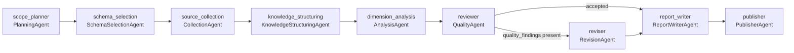

# Rivalens

Rivalens is an AI-driven competitor analysis agent system.

The project is being shaped into a traceable multi-agent workflow for market
intelligence. The main package is `rivalens`, with these primary domains:

- `rivalens/workflows`: DAG task orchestration for competitor analysis.
- `rivalens/agents`: specialist agents for collection, analysis, writing, and quality review.
- `rivalens/schema`: structured competitor knowledge and evidence schema.
- `rivalens/research`: research modes, tools, retrievers, and the underlying research engine.

The generic research implementation lives inside `rivalens/research` as the web
research engine beneath Rivalens agents.

## Architecture

```mermaid
flowchart TB
    User["User / product team"] --> Workflow["rivalens.workflows\nLangGraph DAG"]

    Workflow --> Planner["PlanningAgent\nscope, competitors, dimensions"]
    Workflow --> Selector["SchemaSelectionAgent\nindustry routing + active schema"]
    Workflow --> Collector["CollectionAgent\npublic evidence collection"]
    Workflow --> Knowledge["KnowledgeStructuringAgent\nEvidenceItem -> CompetitorKnowledge"]
    Workflow --> Analyst["AnalysisAgent\nCompetitorKnowledge -> AnalysisClaim"]
    Workflow --> Reviewer["QualityAgent\ntraceability and coverage review"]
    Workflow --> Reviser["RevisionAgent\nrespond to review findings"]
    Workflow --> Writer["ReportWriterAgent\nstructured report"]
    Workflow --> Publisher["PublisherAgent\nartifacts"]

    Planner --> MsgPlan["AgentMessage(type=plan)"]
    Selector --> MsgSelection["AgentMessage(type=schema_selection)"]
    Collector --> MsgEvidence["AgentMessage(type=evidence)"]
    Knowledge --> MsgSchema["AgentMessage(type=schema)"]
    Analyst --> MsgAnalysis["AgentMessage(type=analysis)"]
    Reviewer --> MsgReview["AgentMessage(type=review)"]
    MsgPlan --> MsgGuard["Pydantic payload validation"]
    MsgSelection --> MsgGuard
    MsgEvidence --> MsgGuard
    MsgSchema --> MsgGuard
    MsgAnalysis --> MsgGuard
    MsgReview --> MsgGuard

    Planner --> Toolkit["ResearchToolkit\nagent-facing research tools"]
    Collector --> Toolkit
    Knowledge --> Toolkit
    Analyst --> Toolkit
    Reviewer --> Toolkit

    Toolkit --> Modes["ResearchMode\nRivalens-level mode names"]
    Modes --> Engine["ResearchEngine\nsearch, scrape, context, reports"]
    Engine --> Retrievers["Retrievers\nTavily / Exa / Serper / MCP / local / etc."]

    Planner --> State["CompetitorAnalysisState"]
    Selector --> State
    Collector --> State
    Knowledge --> State
    Analyst --> State
    Reviewer --> State
    Reviser --> State
    Writer --> State
    Publisher --> State

    State --> Evidence["EvidenceItem"]
    State --> ActiveSchema["ActiveKnowledgeSchema"]
    State --> KnowledgeState["CompetitorKnowledge"]
    State --> Claims["AnalysisClaim"]
    State --> QA["QualityFinding"]
    State --> Messages["AgentMessage[]"]
    State --> Artifacts["research_artifacts / agent_events"]
```



## Active Workflow

The active LangGraph entry point is `rivalens/workflows/agent.py`. Its current
multi-agent DAG is:



`schema_selection` first freezes an `ActiveKnowledgeSchema` from the schema
registry. `source_collection` then expands that schema into competitor-by-
dimension collection tasks and runs them concurrently through
`ResearchToolkit.collect_evidence()`, which wraps
`rivalens.research.ResearchEngine` search and deep-research capability as an
evidence collection tool. `ResearchToolkit` also keeps a pooled research
snapshot for deduplicated sources, run metadata, and coverage by competitor and
schema dimension. The final report is produced only after evidence has been
structured into `CompetitorKnowledge`, analyzed, and reviewed over traceable
evidence.

## Structured Agent Messages

Agents exchange validated JSON messages through
`CompetitorAnalysisState.messages`. Each `AgentMessage` contains `sender`,
`receiver`, `type`, `payload`, `artifact_ids`, `evidence_ids`, and `created_at`.
The payload is validated before it is appended to state, using a dedicated
Pydantic schema for each message type:

```text
plan     -> PlanMessagePayload
schema_selection -> SchemaSelectionMessagePayload
evidence -> EvidenceMessagePayload
schema   -> SchemaMessagePayload
analysis -> AnalysisMessagePayload
review   -> ReviewMessagePayload
revision -> RevisionMessagePayload
report   -> ReportMessagePayload
publish  -> PublishMessagePayload
```

Downstream agents consume the latest validated message addressed to them with
`latest_message_for(...)`. This makes each DAG edge behave more like a
function-calling contract: the shared state remains observable, but the handoff
between agents has explicit typed inputs instead of arbitrary free-form text.

## Research Modes

Agents call `ResearchToolkit` methods instead of low-level report types:

```text
standard_evidence  -> research_report
deep_evidence      -> deep
source_discovery   -> resource_report
outline_assisted   -> outline_report
schema_extraction  -> custom_report
focused_analysis   -> detailed_report
subtopic_evidence  -> subtopic_report
```

This keeps agent responsibilities separate from the underlying research engine
while still giving every agent a channel to use the right research capability.

## Current Caveat

The current `ResearchToolkit` wiring is intentionally provisional. Some mappings
are useful as capability channels, but they are still too mechanical:

- `PlanningAgent -> generate_outline() -> outline_report` can help when the user
  has not provided analysis dimensions, but it should not always run.
- `CollectionAgent -> collect_evidence() -> research_report/deep` is the most
  natural mapping and remains the primary evidence-gathering path. It now
  generates schema-aware collection tasks from core fields and industry
  extensions, then runs them concurrently.
- `KnowledgeStructuringAgent -> extract_schema() -> custom_report` is plausible
  for structured extraction, but its current deterministic assembly is still
  basic. The source of truth is now `EvidenceItem -> CompetitorKnowledge`, not
  a generic `ProductFact` fallback.
- `AnalysisAgent -> focused_analysis() -> detailed_report` can support complex
  analysis, but running it by default risks recreating a long-form report path
  instead of reasoning from `CompetitorKnowledge`.
- `QualityAgent -> discover_sources() -> resource_report` is the weakest current
  mapping. Quality review should first audit existing claims and evidence; it
  should only request more source discovery when it finds a coverage or citation
  gap.

The intended next step is to make research-tool calls conditional. Agents should
first execute their core responsibilities against `CompetitorAnalysisState`, then
call `ResearchToolkit` only when the state shows a genuine need: missing scope,
insufficient evidence, ambiguous schema extraction, weak analysis confidence, or
failed quality review.
